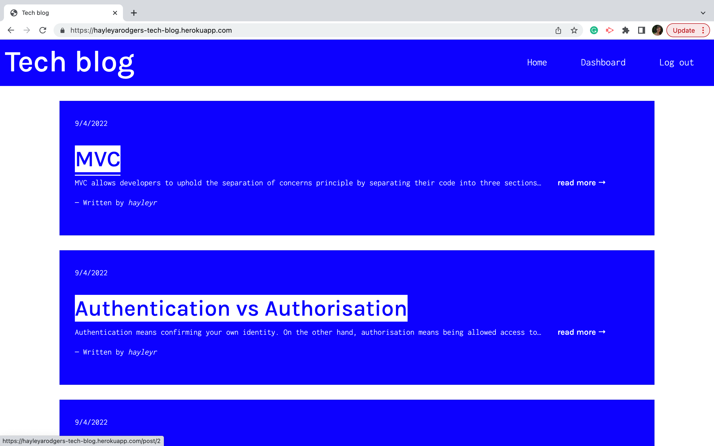
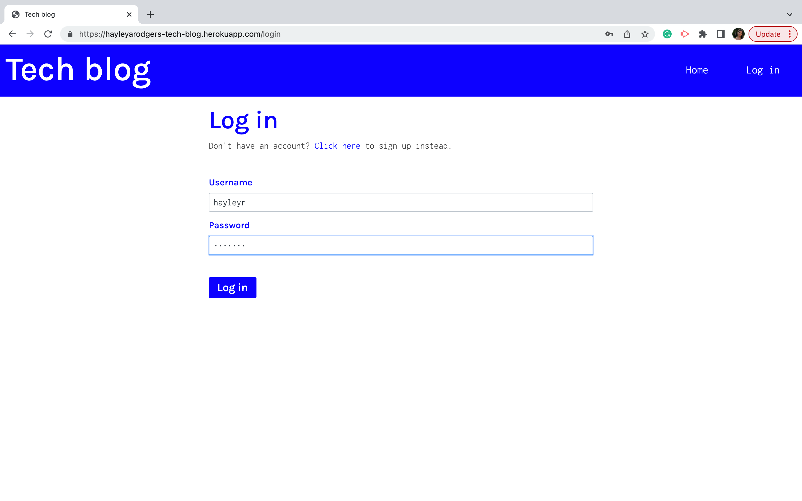
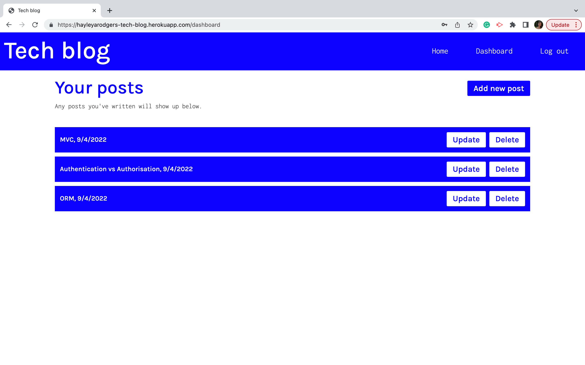
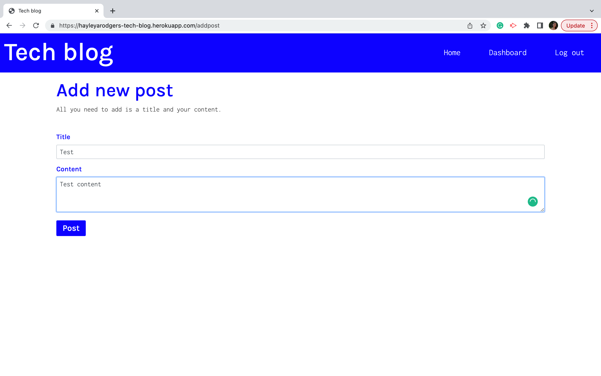
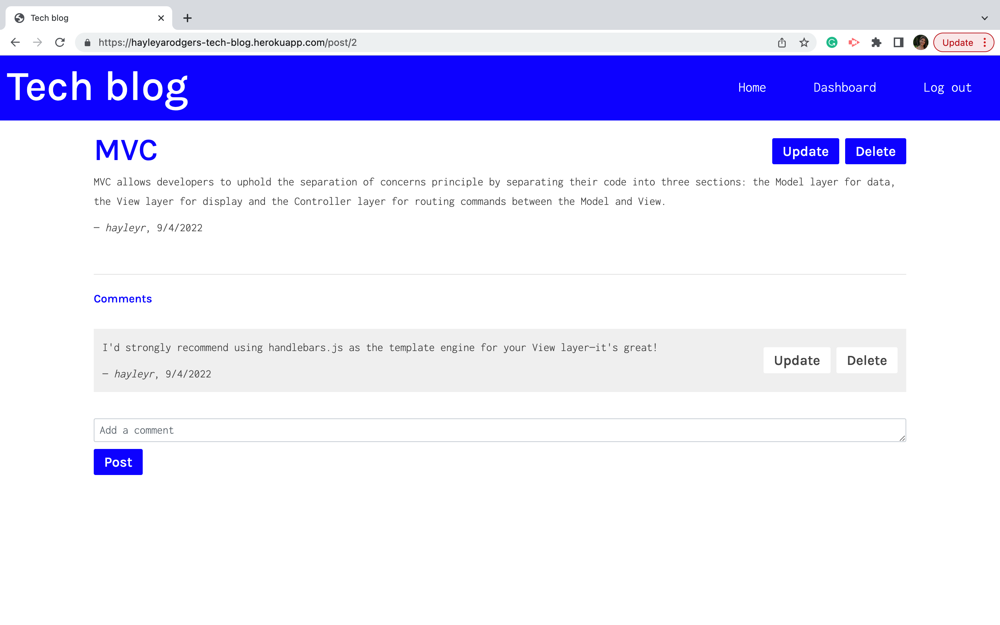

# tech-blog

## Table of Contents

* [Description](#description)
* [Access](#access)
* [Installation](#installation)
* [Usage](#usage)
* [Credits](#credits)

## Description

My goal for this project was to build a CMS-style blog site—where developers can publish their blog posts and comment on other developers’ posts—from scratch.

### User Story

```
AS A developer who writes about tech
I WANT a CMS-style blog site
SO THAT I can publish articles, blog posts, and my thoughts and opinions
```

### Tools and Technologies Used

To create this application, I used used:
- HTML
- CSS
- Bootstrap
- Javascript
- Node.js 
- Express.js
- Express-handlebars
- MySQL2
- Sequelize
- Dotenv
- Bcrypt
- Express-session
- Connect-session-sequelize
- And, Heroku.

### Screenshots of Application











## Access

### Code Repository

The repository where the code is saved is on Github. To access it, click [here](https://github.com/hayleyarodgers/tech-blog).

### Live Application

My application is deployed on Heroku. To access it, click [here](https://hayleyarodgers-tech-blog.herokuapp.com/).

## Installation

To install necessary dependencies, run the following command:

```
npm i
```

## Usage

To use the application from the command line:
1. Open the repository in your terminal or bash.
2. Add a .env file in the same format as [this file](.env.EXAMPLE).
3. Log into MySQL in the command line by entering ```mysql -u root -p``` and the password in your .env file.
4. Create the database by entering ```SOURCE ./db/schema.sql;```.
5. Quit MySQL by entering ```quit```.
6. (Optional) Seed the database with sample data by entering ```npm run seed``` in the command line.
7. Start the server by entering ```npm start``` in the command line.

Alternatively, to use the live application, click [here](https://hayleyarodgers-tech-blog.herokuapp.com/).

## Credits

- I used [Bootstrap](https://getbootstrap.com/docs/4.5/getting-started/introduction/) for most of my CSS styling.
- I used the [express-handlebars](https://www.npmjs.com/package/express-handlebars) package to use Handlebars.js as my templating engine.
- I used the [MySQL2](https://www.npmjs.com/package/mysql2) and [Sequelize](https://www.npmjs.com/package/sequelize) packages to connect to my MySQL database and perform queries.
- I used the [dotenv](https://www.npmjs.com/package/dotenv) package to use environment variables to store sensitive data needed to run the application.
- I used the [bcrypt](https://www.npmjs.com/package/bcrypt) package to hash passwords.
- I used the [express-session](https://www.npmjs.com/package/express-session) and [connect-session-sequelize](https://www.npmjs.com/package/sequelize) packages to add authentication.